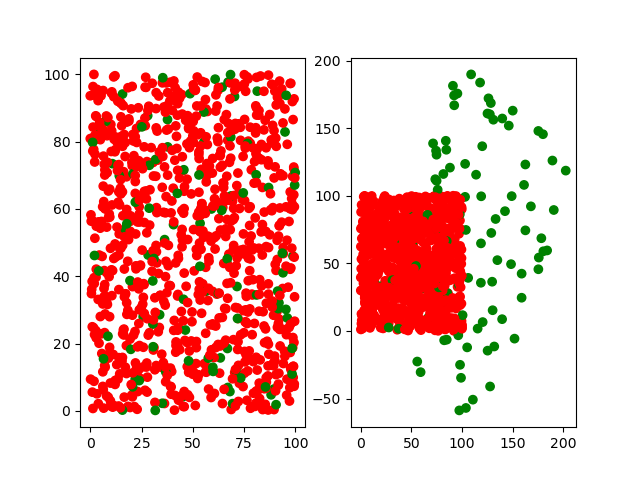
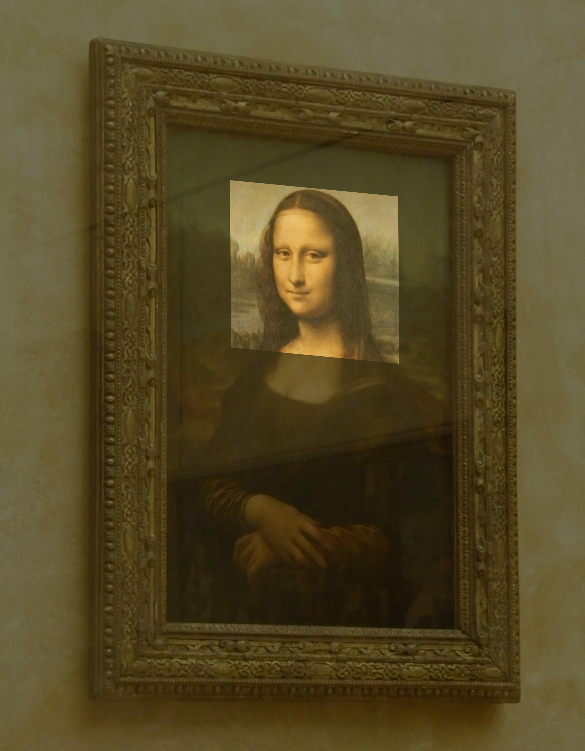

# ImageRegistration 
##  1. with opencv and numpy
##  2. with pure numba mode on GPU 
A demo that implement image registration by matching SIFT descriptor and appling affine transformation.


```
python image_registration

outputs may like:
gt_info:
[[ 0.9409774   1.15946488]
 [ 1.99787199 -0.78970898]] 
 [[3.63735738]
 [1.80984332]] 

estimate_affine:
[[ 0.60508127 -1.31431522]
 [ 0.1427207   0.1456731 ]] 
 [[105.25057471]
 [ 36.50657498]] 

ransac:
[[ 0.9409774   1.15946488]
 [ 1.99787199 -0.78970898]] 
 [[3.63735738]
 [1.80984332]] 
```






## add numba code with ransac on cuda (without numpy function)

```python
fab gpu_test

outputs may like:
(2, 1000) (2, 1000)
gt_info:
 A:
 [[ 1.61475809  0.90018426]
 [ 0.48580563 -0.09157409]]
 t:
 [[-5.75177497]
 [-0.72593315]]
/root/anaconda3/lib/python3.9/site-packages/numba/cuda/compiler.py:865: NumbaPerformanceWarning: Grid size (2) < 2 * SM count (160) will likely result in GPU under utilization due to low occupancy.
  warn(NumbaPerformanceWarning(msg))
ransac:
 A:
 [[ 1.6147596   0.90018564]
 [ 0.48580563 -0.09157424]]
 t:
 [-5.7519393 -0.7259231] 

Done.

```

reference:

https://github.com/ThomIves/LeastSquaresPurePy